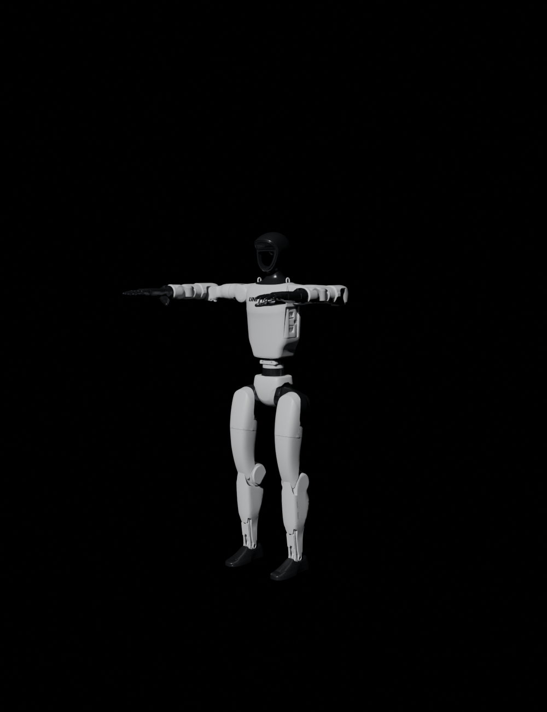
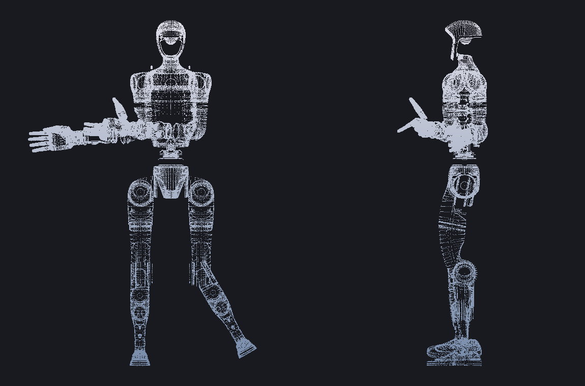
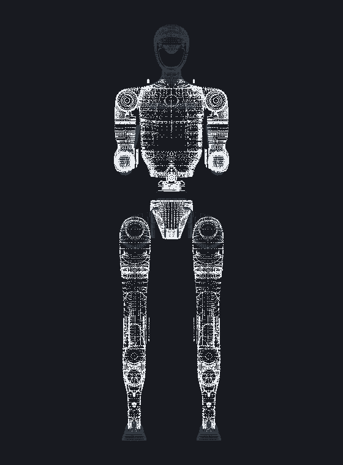

# Unitree G1 骨骼管线：unitree_ros → Blender 5 → Maya 2025 (USD)

> 目标：拿到**宇树 G1 人形机器人**的骨骼文件，在 **Windows 11 + Blender 5.x + Maya 2025** 里做成可绑定、可动画的骨架（含**灵巧手**版本）。
>
> 全程 **不需要安装 ROS**。

```
┌────────────────┐   ┌─────────────────────┐   ┌──────────────────────┐   ┌──────────────┐
│ unitree_ros    │   │ Blender 4.4+/5.x    │   │ USD (.usda)          │   │ Maya 2025    │
│ git clone      │ → │ blender_import_urdf │ → │ Y-up / 厘米 /UsdSkel│ → │ joint +      │
│ G1 URDF + STL  │   │ 骨骼+网格+蒙皮+材质  │   │ 蒙皮骨骼             │   │ skinCluster  │
└────────────────┘   └─────────────────────┘   └──────────────────────┘   └──────────────┘
       ①                      ②                         ③                    ④
```

**本管线已在 Blender 5.0.1 与 4.5 LTS 上实测验证**（以 `g1_29dof_rev_1_0_with_inspire_hand_DFQ.urdf` 为例）：

| 检查项 | 实测结果 |
|---|---|
| 骨骼数 | 59（= 29 身体关节 + 24 灵巧手关节 + 6 结构骨骼）；`--hik` 默认再加 3 根零权重虚拟骨（颈椎+双脚尖，供 MotionBuilder/Maya HIK，可随时删） |
| 网格数 | 59 个蒙皮网格，每个 100% 权重绑到对应骨骼（刚体绑定） |
| 整机尺寸 | 132.3 cm（与 G1 官方 ~132 cm 一致） |
| USD 规格 | `upAxis=Y`、`metersPerUnit=0.01`（厘米）、`UsdSkel` 骨架 + 蒙皮绑定 |
| 往返测试 | 导出的 USD 重新导入 Blender：骨骼、蒙皮、姿态变形全部正常 |
| 姿态测试 | 肩关节 -70° → 手部位移 0.457 m；手指弯曲 45° → 指尖位移 0.038 m |


*点云预览（由脚本生成的 .blend 直接投影）：左=正视图，右=侧视图。零位为手自然下垂站姿。*


*同一骨架抬起双肩、弯曲手指后的点云投影——骨骼/蒙皮工作正常。*


*材质分配预览：白色外壳件 vs 深灰金属件（官方无贴图，脚本按 URDF 材质标签映射 + 自动 UV，见 FAQ Q11）。*

---

## 目录

- [0. 环境要求](#0-环境要求)
- [1. 一键下载 unitree_ros](#1-一键下载-unitree_ros)
- [2. Blender 导入 G1](#2-blender-导入-g1)
- [3. URDF → USD](#3-urdf--usd)
- [4. Maya 2025 导入](#4-maya-2025-导入)
- [备选路线](#备选路线)
- [坐标与单位速查](#坐标与单位速查)
- [关节元数据（重定向用）](#关节元数据重定向用)
- [常见问题 FAQ](#常见问题-faq)

---

## 0. 环境要求

| 软件 | 版本 | 说明 |
|---|---|---|
| Windows | 11 | 管线跨平台，但本文按 Win11 写 |
| Git | 任意新版 | [Git for Windows](https://git-scm.com/download/win) |
| Blender | **4.4 / 4.5 LTS / 5.x** | USD 厘米单位导出需要 4.4+；4.2/4.3 也能用（见 FAQ） |
| Maya | **2025**（2022+ 均可） | 内置 maya-usd 插件，无需额外安装 |
| ROS | **不需要** | — |

本仓库文件：

```
g1-rig-pipeline/
├── README.md                     ← 本文档
├── scripts/
│   ├── blender_import_urdf.py    ← 核心：URDF → Blender 骨骼+蒙皮 → USD（已实测）
│   ├── maya_import_g1.py         ← Maya 2025 导入 + 自动检查脚本
│   ├── download_g1.bat           ← 一键下载 G1 资产（Windows 双击/命令行）
│   └── convert_g1.bat            ← 一键 URDF → USD（调用 Blender 后台）
└── docs/
    ├── img/                      ← 实测预览图
    └── example/                  ← 生成的关节元数据示例 (JSON)
```

---

## 1. 一键下载 unitree_ros

宇树官方仓库：**https://github.com/unitreerobotics/unitree_ros**
G1 的 URDF 和 STL 网格位于 `robots/g1_description/`。

> ⚠️ 完整仓库约 **315 MB**（包含 A1/Go2/H1/B2 等所有机型）。推荐用 **sparse checkout 只下载 G1 部分（约 111 MB）**。

### 方式 A（推荐）：sparse 精准下载

**CMD / Git Bash（一行搞定）：**

```bat
git clone --depth 1 --filter=blob:none --sparse https://github.com/unitreerobotics/unitree_ros.git && cd unitree_ros && git sparse-checkout set robots/g1_description
```

**PowerShell（Windows 11 自带的 5.1 不支持 `&&`，分三行执行）：**

```powershell
git clone --depth 1 --filter=blob:none --sparse https://github.com/unitreerobotics/unitree_ros.git
cd unitree_ros
git sparse-checkout set robots/g1_description
```

**或者直接双击运行本仓库的 `scripts\download_g1.bat`**（自动检查 git、断点跳过、附文件说明）：

```bat
scripts\download_g1.bat                 :: 下载到当前目录\unitree_ros
scripts\download_g1.bat D:\robots all   :: 指定目录, 并额外下载 G1-D/独立灵巧手
```

### 方式 B：完整克隆（需要全部机型时）

```bat
git clone https://github.com/unitreerobotics/unitree_ros.git
```

### 方式 C：不想装 git？直接下 ZIP

浏览器打开 <https://github.com/unitreerobotics/unitree_ros/archive/refs/heads/master.zip>（约 300+ MB，全机型）。

### 下载哪个 URDF？（G1 变体选型表）

`robots/g1_description/` 下的 URDF（宇树官方 README 的 DOF 表 + 实测关节数）：

| URDF 文件 | 机器人形态 | 可动关节 | 手部 |
|---|---|---|---|
| **`g1_29dof_rev_1_0_with_inspire_hand_DFQ.urdf`** ⭐ | G1 + **Inspire 五指灵巧手 ×2** | **53**（29 身体 + 12×2 手） | 5 指灵巧手 |
| `g1_29dof_rev_1_0_with_inspire_hand_FTP.urdf` | 同上（Inspire FTP 型号） | 53 | 5 指灵巧手 |
| `g1_29dof_with_hand_rev_1_0.urdf` | G1 + 三指手 ×2 | 43（29 + 7×2） | 3 指 |
| `g1_29dof_rev_1_0.urdf` | G1 纯身体（无手） | 29 | 无 |
| `g1_29dof_lock_waist_with_hand_rev_1_0.urdf` | 腰部锁定版 + 三指手 | — | 3 指 |
| `g1_29dof_mode_15_with_dex1_1.urdf` | G1 + Dex1-1 夹爪 ×2 | — | 1 自由度夹爪 |
| `g1_23dof_rev_1_0.urdf` | 23 自由度低成本版 | 23 | 无 |
| `robots/g1_d_description/g1_d.urdf` | **G1-D 轮式底盘**（升降柱+双轮+三指手） | 34（30 转动+2 轮+2 升降） | 3 指 |

⭐ **推荐**：做角色绑定/动画选 `..._with_inspire_hand_DFQ.urdf`（真·灵巧手，每只手 12 个可动关节，拇指 4 骨 + 四指各 2 骨）。
带 `mode_XX` 的文件对应不同电机配置（`mode_machine` 编号在宇树 App：设备→数据→机器人→机型 里查），拿不准就用 `rev_1_0` 系列。
另有独立手部描述 `robots/dexterous_hand_description/`（dex1_1 / dex2_5 / dex3_1 / dex5_1）可单独转换。

---

## 2. Blender 导入 G1

### 方式 A（推荐）：本仓库脚本，零依赖、已实测

`scripts/blender_import_urdf.py` 用纯标准库解析 URDF，不装任何插件、不需要 ROS：
建骨骼（骨骼名 = URDF link 名，骨骼位置 = 关节原点）、导入 STL 网格、100% 权重蒙皮、按 URDF 材质上色、导出 USD 和关节元数据。

**GUI 用法（推荐先看一眼效果）：**

1. 打开 Blender（建议新开空文件）
2. 顶部切到 **Scripting** 工作区
3. `Open` 打开 `scripts/blender_import_urdf.py`
4. 修改文件开头的 `CONFIG`：

```python
CONFIG = {
    "urdf":   r"D:\BlenderPro\G1\unitree_ros\robots\g1_description\g1_29dof_rev_1_0_with_inspire_hand_DFQ.urdf",
    ...
}
```

5. 点 **▶ Run Script**。3D 视图会出现完整的 G1（骨骼显示在体前，`Show In Front` 已开）。

> 说明：GUI 模式**不会重置/清空你当前打开的文件**（机器人放在新建的 collection 里）；重复运行会自动清理上一次生成的同名内容。默认也不自动保存 `.blend`（控制台会打印建议路径），USD/JSON 照常自动导出。

**命令行用法（后台批处理，不开界面）：**

```bat
blender --background --python blender_import_urdf.py -- "D:\BlenderPro\G1\unitree_ros\robots\g1_description\g1_29dof_rev_1_0_with_inspire_hand_DFQ.urdf" --blend "D:\BlenderPro\G1\g1.blend" --usd "D:\BlenderPro\G1\g1.usda" --meta "D:\BlenderPro\G1\g1.json" --render "D:\BlenderPro\G1\g1.png"
```

或者直接用 `scripts\convert_g1.bat`（自动找 blender、建输出目录）：

```bat
scripts\convert_g1.bat D:\BlenderPro\G1\unitree_ros\robots\g1_description\g1_29dof_rev_1_0_with_inspire_hand_DFQ.urdf D:\BlenderPro\G1
```

常用参数：

| 参数 | 默认 | 说明 |
|---|---|---|
| `--blend / --usd / --meta / --render` | URDF 同目录 | 输出文件路径 |
| `--scale` | 1.0 | 整体缩放（URDF 原生单位=米，一般不动） |
| `--usd-units` | `cm` | USD 单位：`cm`（配 Maya 默认）/ `m`（物理米） |
| `--usd-up` | `Y` | USD 上轴：`Y`（Maya 标准）/ `Z`（保持 URDF 原生） |
| `--keep-urdf-orientation` | 关 | 默认把骨架转成 Maya 惯例（面朝 +Z） |
| `--skip-links` | `force_sensor\|imu\|d435\|mid360` | 正则过滤噪声 link（传感器等） |
| `--no-uv` | 关 | 默认自动展 UV（STL 无 UV，想贴图必须有；见 FAQ Q11） |
| `--flat-colors` | 关 | 默认用白壳/深灰金属美化材质；此参数退回 URDF 原始纯色 |

**导入后检查：**

- 大纲里有一个 `*_skeleton` Armature + 两个 Collection（骨骼 / 网格）
- G1 站在原点，脚底在 Z=0，总高约 1.32 m（Blender 是 Z-up 世界，和 URDF 一致）
- 选中骨骼旋转（比如 `left_shoulder_pitch_link`）→ 对应手臂网格跟着动
- 注意：**Blender 姿态骨骼默认旋转模式是四元数**，脚本存了每个关节的旋转轴/限位（见[关节元数据](#关节元数据重定向用)），想精确按机器人关节轴摆位可参考该表

### 方式 B：LinkForge 插件（Blender Extensions 官方插件，图形界面）

如果你更喜欢在插件 UI 里操作（导入 URDF/XACRO、编辑、再导出 URDF）：

1. Blender → **Edit → Preferences → Get Extensions**（Blender 4.2+；离线版可在 [extensions.blender.org/add-ons/linkforge](https://extensions.blender.org/add-ons/linkforge/) 下载 zip 后 `Install from Disk`）
2. 搜索 **LinkForge** → Install
3. 它是"可视化机器人 IDE"，支持 URDF/XACRO 导入、关节配置、导出到 Gazebo/MuJoCo/Isaac Sim；兼容 **Blender 4.2 LTS ~ 5.x**
4. 注意：它是面向机器人建模的（导入后是 Link/Joint 层级），**导出 USD 给 Maya 仍建议用方式 A 的绑定流程**（方式 A 直接生成 UsdSkel 蒙皮）

### 方式 C（了解即可）：经典 HoangGiang93/urdf_importer

社区最常被引用的 URDF 导入插件 <https://github.com/HoangGiang93/urdf_importer>（Sony Research 出品），
**但它要求 ROS/ROS2 环境**（要往 Blender 自带 Python 里 `pip install rospkg urdf_parser_py` 并设置 `ROS_ROOT`），在 Windows 上比较折腾，Blender 5 支持也不明确。本仓库脚本就是为绕开它而写的。

---

## 3. URDF → USD

> 如果你是用方式 A 的脚本/`convert_g1.bat` 跑的，**这一步已经自动完成**（默认导出 `cm + Y-up + UsdSkel`），直接看[第 4 步](#4-maya-2025-导入)。以下为手动导出时对照。

在 Blender 里 **File → Export → Universal Scene Description (.usd\*)**，推荐设置：

| 选项 | 值 | 原因 |
|---|---|---|
| Convert Orientation | ✅ 开 | Blender 是 Z-up，USD/Maya 是 Y-up |
| Up / Forward | Y / -Z | Maya 标准 |
| Convert Scene Units / Meters Per Unit | **Custom → 0.01（厘米）** | Maya 默认工作单位是 cm，1:1 对上，132cm 的 G1 进 Maya 就是 132 |
| Armatures | ✅ 开 | 导出 UsdSkel 骨架 |
| Only Deform Bones | 可关 | 关掉会带非形变骨（本管线没有，无所谓） |
| Custom Properties | ✅ 开 | 骨骼上的 `urdf_axis` / `urdf_limit_*` 会写进 USD |
| Materials | Preview Surface | URDF 颜色 → UsdPreviewSurface |
| Animation | 关 | 需要导出动画时再开 |

导出后你会得到一个 `.usda`（或 `.usd`），内部结构：

```
def SkelRoot "g1_..._skeleton"
  ├─ def Skeleton   (59 joints, bind/rest 变换)
  └─ def Mesh ×59   (primvars:skel:jointIndices / jointWeights → 每网格 100% 单骨骼)
```

这就是标准的 **UsdSkel** 蒙皮骨骼——Maya、Houdini、USD View、Isaac Sim 都能直接读。

> 💡 想让文件更小：把 `--usd` 的输出路径后缀从 `.usda` 改成 `.usdc`（二进制 crate）或 `.usdz`（打包），Blender 会按扩展名自动选择格式（文本 usda 约 87 MB，二进制约 1/3，内容完全一致）。

---

## 4. Maya 2025 导入

### 方式 A：脚本导入（推荐，带自动检查）

1. 打开 **Script Editor**（窗口 → 常规编辑器 → 脚本编辑器）→ **Python** 标签
2. 粘贴 `scripts/maya_import_g1.py` 全部内容，改开头一行路径：

```python
USD_FILE = r"D:\BlenderPro\G1\g1_29dof_rev_1_0_with_inspire_hand_DFQ.usda"
```

3. **Ctrl+Enter** 运行。预期输出：

```
[OK] 导入完成, 新增顶层节点 ...
============================================================
场景检查 / Rig report
  joints      : 59
  meshes      : 59
  skinClusters: 59
  骨骼包围盒高度: 132.x cm  (G1 整机约 132 cm)
  根骨骼示例    : [u'|g1_..._skeleton|pelvis']
============================================================
```

### 方式 B：菜单导入

1. **File → Import...**，文件类型选 **USD**（或 USD Import）
2. 选中 `.usda` → Options 里保持默认（Import As: Native Data / Merge）→ Import
3. 大纲中出现 `pelvis` 为根的关节树 + 59 个网格（各自带 skinCluster）

### 方式 C：USD Stage（保持 USD 数据流，按需转 Maya）

1. **Create → Universal Scene Description (USD) → Stage From File...** 选择 `.usda`
2. 骨骼先以 USD 形式显示；在 Outliner 里右键骨骼根 → **Edit As Maya Data** 即可转成原生 Maya joint
3. 适合想保持 USD 流程、或只临时参考的场合；**要改权重/绑定请用方式 A/B**

### 导入后检查清单

- ✅ 关节数 59（DFQ 版；三指手 49；无手 35）
- ✅ 总高 ~132 cm（Maya 默认 cm）
- ✅ 旋转 `left_shoulder_pitch_link`，左臂整体跟随
- ✅ 网格都有 skinCluster（Windows → Animation Editors → Component Editor 可查权重，每网格单骨骼 1.0）

### 单位说明（重要）

| 环节 | 单位 | 上轴 | 朝向 |
|---|---|---|---|
| URDF（unitree_ros） | 米 | Z | 面朝 +X |
| Blender 场景 | 米 | Z（Blender 世界即 Z-up） | 面朝 -Y（脚本已转） |
| 本管线导出的 USD | **厘米**（metersPerUnit=0.01） | Y | 面朝 **+Z**（Maya 角色标准） |
| Maya 2025 默认 | 厘米 | Y | +Z |

所以 **USD → Maya 零缩放、零旋转、即开即用**。
若你用 `--usd-units m` 导出了米制 USD：要么导入前把 Maya 的 Linear 工作单位改成 meter（Preferences → Settings → Working Units），要么导入后运行 `maya_import_g1.py` 里的 `scale_rig(100)`（只缩放 joint，蒙皮网格跟随，不会双重变换）。

---

## 备选路线

### FBX（最"复古"也最稳的保底）

Blender：选中全部 → **File → Export → FBX (.fbx)**，默认设置即可（Armature/Skinning 都开）→ Maya：**File → Import**。joint + skinCluster 传得最稳，缺点是单位/轴向要手动核对（FBX 里是 cm/Y-up，与 Maya 默认一致）。图形管线出问题时优先用它救场。

### Isaac Sim（机器人仿真级 USD）

如果最终目标是仿真/强化学习（NVIDIA Isaac Sim / Isaac Lab），建议用 Isaac Sim 自带的 **URDF Importer**（Python API `isaacsim.asset.importer.urdf`）直接 URDF→USD，会额外生成物理碰撞体、关节驱动等 schema；其骨架同样是 UsdSkel，Maya 可读。注意那是"仿真资产"，做角色绑定仍以本管线输出为佳（网格干净、无物理代理体）。

### MuJoCo 快速预览 URDF（不动 Blender）

```
pip install mujoco
python -m mujoco.viewer
```
把 URDF 拖进窗口即可 3D 预览（宇树官方 README 也是这么推荐的）。可用于在转换前确认自己下对了文件。

---

## 坐标与单位速查

| URDF (unitree_ros) | Blender | USD（本管线） | Maya 2025 |
|---|---|---|---|
| 米 | 米 | 厘米 | 厘米 |
| Z-up | Z-up | **Y-up** | Y-up |
| 前进 +X | 前进 -Y | 前进 **+Z** | 前进 +Z |
| 骨架根 `pelvis`（髋部原点） | 同左 | 同左 | 同左 |

- 脚底在 Y=0（USD/Maya 中），头在 +132cm 附近
- 骨骼名 = URDF link 名（`pelvis / torso_link / left_shoulder_pitch_link / L_thumb_distal ...`），和宇树 SDK/文档里的关节名一一对应

---

## 关节元数据（重定向用）

脚本会生成 `<名字>_skeleton_meta.json`（示例见 `docs/example/`），包含每个关节的：

- `type`：revolute / continuous / prismatic / fixed
- `axis_in_child_frame`：URDF 旋转轴（在子 link 坐标系）
- `origin_xyz_m` / `origin_rpy_rad`：关节原点
- `limits`：`lower_rad / upper_rad / effort_nm / velocity_rad_s`

同时这些信息也写在 Blender 骨骼的自定义属性上（`urdf_joint_name / urdf_axis / urdf_limit_lower / ...`），开启 USD 导出的 Custom Properties 后随文件走。

做动捕重定向（比如 HumanIK / 自研 retarget）时，用它把"人形骨骼的摆动"翻译成"机器人关节的正确旋转轴+限位"。

---

## 常见问题 FAQ

**Q0：报错 `RuntimeError: Operator bpy.ops.object.mode_set.poll() Context missing active object`**
旧版脚本在 GUI/启动阶段会先"重置为空文件"，个别上下文里这会让"活动对象"赋值失效，导致进不了骨骼编辑模式。**2025-09 修复版已彻底解决**（GUI 模式不再重置文件，只自动清理上次生成的内容；并加入活动对象校验 + 中文报错指引）。请从 PR #1 重新下载 `blender_import_urdf.py` 覆盖旧文件。推荐两种运行方式：
- Blender 界面 → **Scripting** 标签 → Open 打开脚本 → Run Script（不会动你当前打开的文件）
- 命令行标准形式：`blender --background --python blender_import_urdf.py -- <urdf路径> --usd 输出.usda`（注意 `--` 不能少；直接 `blender 脚本.py` 也能跑，但不推荐）

**Q1：Blender 5.0 还没有 URDF 导入插件怎么办？**
Blender 官方从未内置 URDF 导入。本仓库脚本就是为 Blender 4.4~5.x 写的（已在 5.0.1 / 4.5 LTS 实测）；要图形界面插件可用 LinkForge（官方 Extensions 平台，支持到 5.x）。

**Q2：Blender 4.2/4.3 能用吗？**
脚本可以跑，但 4.4 以下的 USD 导出没有"单位换算"选项，导出的是米制 USD。此时给 Maya 导入前把 Linear 单位设为 meter，或导入后 `scale_rig(100)`。升级到 4.4+/4.5 LTS/5.x 体验最佳。

**Q3：Maya 导入后只有网格没有骨骼？**
确认用的是 **File → Import（原生数据）** 或 `mayaUSDImport`，而不是 Reference；Maya 2022+ 才内置 maya-usd。若版本旧，请改走 FBX 路线。

**Q4：Maya 里机器人只有 1.3cm 高？**
说明 USD 是米制导出的（旧版 Blender 或用了 `--usd-units m`）。解决：`scale_rig(100)` 或重导出为 cm。

**Q5：骨骼姿态一转就"飞掉"（乱转）？**
机器人的 URDF 旋转轴不一定是骨骼局部轴。摆位时按 `*_skeleton_meta.json` 里的 `axis` 对应的分量转；或干脆整骨用 Rotate Tool 的局部轴试。另外 Blender 姿态骨骼默认四元数模式（脚本生成的骨骼同理），数值化摆位前先把旋转模式设为 Euler。

**Q6：网格看起来全是"碎块"接缝？**
正常——机器人本来就是刚体连杆结构，每个 link 一块网格。渲染时接缝就是真实机械结构的位置。想要"一体化"皮肤需要自己重新平滑蒙皮（把相邻 link 权重做渐变过渡）。

**Q7：材质只有白/深灰两色？**
这是官方 URDF 的定义（只有 `white`/`dark` 两个纯色）。脚本默认已替换为白壳+深灰金属预设并自动展 UV，详见 Q11。

**Q8：`stl_import` 之后网格发黑/法线反？**
个别 STL 有反法线，选中网格 Object → Shade Smooth + Mesh → Normals → Auto Smooth（脚本默认已做 40° auto smooth）。仍有问题就外面套个 Solidify/Normal 编辑。

**Q9：我想让机器人面朝 -Z（背对 +Z）？**
`--keep-urdf-orientation` 保持 URDF 原生朝向，或在 Maya 里把根骨骼 `pelvis` 转 180°。

**Q10：G1-D（轮式）、H1/H2 等其他宇树机型也能用吗？**
能。脚本对任意 URDF 通用（G1-D 已实测：41 骨骼、轮子/升降柱正常）。H1/H2/Go2 等在 `unitree_ros/robots/` 下都有对应 `*_description`，用 sparse-checkout 把那个目录加进来即可。

**Q11：没有材质贴图？官方提供了吗？**
**官方确实没提供贴图**：URDF 里只定义了两个纯色材质（`white` = 0.7 灰、`dark` = 0.2 深灰），`meshes/` 目录全是 STL，没有任何贴图/法线/MTL 文件。脚本已做两层补强：
1. **美化材质预设**（默认开启）：`white` → 哑光白壳（roughness 0.42），`dark` → 深灰金属（metallic 0.85 / roughness 0.30），观感接近真机；想严格用官方纯色加 `--flat-colors`；
2. **自动展 UV**（默认开启，`--no-uv` 关闭）：STL 导入本来没有 UV，不展 UV 在 Maya/Substance 里根本没法贴图。脚本会做"三面投影 + 自动图集"（每个零件一个格子、格内按投影方向分 6 小格、零件间零重叠），UV 随 USD 导出到 Maya（`st` primvars，59/59 网格）。之后就可以在 Maya Hypershade 里连贴图，或扔进 Substance Painter 按 59 个部件分别上材质。

想要现成的 PBR 贴图模型：社区有付费资源（如 Fab/Sketchfab 上 RandomRepresent 的 "Unirandom G1"，4K PBR 贴图 + 已绑定）；免费 AI 重建版本质量参差；宇树官方暂无发布。渲染级需求的常见做法：用本管线拿到干净绑定 + 自动 UV，贴图环节在 Substance/Maya 里完成。

**Q12：USD 文件怎么变小？**
带 UV 的 `.usda` 文本约 128 MB。把输出后缀改成 `.usdc`（二进制）约 1/3 大小，内容完全一致；`.usdz` 则是打包格式（单文件分发，Maya 2025 也能直接读）。

**Q13：Maya 脚本提示找不到 USD 文件？**
USD **不需要手动导出**：`blender_import_urdf.py` 每次运行成功都会自动生成，默认保存在 **URDF 同目录**（如 `D:\BlenderPro\G1\unitree_ros\robots\g1_description\g1_..._DFQ.usda`）。GUI 模式运行完成后会**弹窗显示完整路径**（也可在 Window → Toggle System Console 看 `USD :` 那行）。把 `maya_import_g1.py` 开头的 `USD_FILE` 改成这个完整路径即可。

**Q14：Maya 导入报 `Ill-formed SdfPath` / `Invalid prim name '鍘熺悊鍖朹BSDF'`？**
**中文版 Blender 的坑**：中文界面下 Principled BSDF 节点名是 `原理化BSDF`，Blender 导出 USD 时把它写成了 Shader prim 名；Maya（Windows/GBK 环境）解析非 ASCII prim 名失败，整个文件导入报错（乱码 `鍘熺悊鍖朹BSDF` 就是 UTF-8 的"原理化BSDF"被按 GBK 读出来的样子）。**2025-09-18 后的脚本已修复**：节点按类型查找 + 强制所有节点名 ASCII。用新版脚本在 Blender 里重新 Run Script（自动覆盖旧 .usda）即可。不想重跑的话，用 VSCode/Notepad++ 打开 .usda，把 `原理化BSDF` 全部替换为 `Principled_BSDF`（保持 UTF-8 保存）也能修好。

**Q15：Houdini 21 怎么用这个 USD？USD Character Import 导入后方向/大小都不对？**
可以加载，但注意单位。这份给 Maya 的 USD 是**厘米制**（metersPerUnit=0.01），而 Houdini/Solaris 原生是**米**；OpenUSD 引用时**不做自动单位换算**，所以厘米文件进 Houdini 会差 100 倍。正确姿势：

1. **给 Houdini 单独出一份米制 USD**（推荐，一次到位）：
   ```bat
   scripts\convert_g1.bat D:\BlenderPro\G1\unitree_ros\robots\g1_description\g1_29dof_rev_1_0_with_inspire_hand_DFQ.urdf D:\BlenderPro\G1 "" m
   ```
   生成 `..._m.usda`（实测 metersPerUnit=1.0、整机 1.323 m、Y-up，与 Houdini 完全同调；`_m` 后缀不会覆盖 Maya 用的厘米版）。
2. **Solaris（LOPs）直接加载**：`/stage` 里放 **File LOP**（或 Sublayer/Reference）→ 选 `.usda` → 视口所见即所得（Hydra 直接渲染 UsdSkel，无需转换）。
3. **SOP/KineFX（`USD Character Import`）**：它是把 UsdSkel 转成 KineFX 骨架+蒙皮的**转换节点**，多个输出（骨架/网格/权重）**要连在一起用**，单独拆开看本来就是"碎"的。另外一定要打开它的 **Convert Units** 参数（SideFX 官方文档明确：大小差 100 倍就是米/厘米单位问题，开它解决）。用米制文件 + Convert Units 后大小方向即恢复正常；若骨骼和网格仍差一个 90°，是节点丢根变换（`/root` 上有 -90°X 的 Z-up→Y-up 转换旋转）——给错位的那一路加个 Transform SOP 转 90° 即可对齐。
4. 相关节点：`USD Animation Import`（只导骨骼+动画）、`USD Skin Import`（只导蒙皮权重）。

**Q16：MotionBuilder 里无法创建 HIK 角色（"骨骼不够"）？能自己加虚拟骨骼吗？**
可以，加虚拟骨（helper bones）正是 HIK 适配非人形骨骼的标准做法。而且有个好消息：**G1 的 HIK 15 个必需节点其实都有真实骨骼**（HIK 官方必需项：Hips / Spine / Head / 双臂各 3 / 双腿各 3，Neck 和手指都是可选）——先按下面的映射表把 Definition 填满，大多情况根本不用加骨：

| HIK 槽位 | G1 骨骼 | HIK 槽位 | G1 骨骼 |
|---|---|---|---|
| Reference / Hips | `pelvis` | LeftArm / RightArm | `left/right_shoulder_pitch_link` |
| Spine | `waist_yaw_link` | LeftForeArm / RightForeArm | `left/right_elbow_link` |
| Spine1 | `waist_roll_link` | LeftHand / RightHand | `left/right_wrist_roll_link` |
| Spine2 | `torso_link` | LeftUpLeg / RightUpLeg | `left/right_hip_pitch_link` |
| Head | `head_link` | LeftLeg / RightLeg | `left/right_knee_link` |
| Neck（可选） | `neck_link`（虚拟） | LeftFoot / RightFoot | `left/right_ankle_pitch_link` |
| LeftToeBase / RightToeBase（可选） | `left/right_toe_link`（虚拟） | 手指（可选） | `L/R_thumb_proximal…` 等 22 槽全可填 |

**脚本已内置 `--hik`（默认开启，`--no-hik` 关闭）**：自动补 3 根零权重虚拟骨——`neck_link`（挂在 torso 与 head 之间，让头颈重定向更平滑）、`left/right_toe_link`（挂在脚掌下，让 HIK 的脚部地板接触/foot roll 生效）。虚拟骨不带任何蒙皮权重，**之后删除对模型零影响**。映射表也写进了 `_skeleton_meta.json` 的 `hik.mapping` 字段。

关于"导出时删掉虚拟骨"：
- 它们零权重，**留着其实无害**（机器人侧按名字忽略即可，meta JSON 的 `hik.helpers` 有清单）；
- 要删的话：MotionBuilder 里直接选中删除（先把子级重新挂回父级，如删 neck 前把 head 挂回 torso）；Maya 里删除 joint 不会影响任何 skinCluster；
- 在 Blender 源头用 `--no-hik` 重导一份"干净版"也行。

**重要的心理预期**：HIK 重定向只驱动 Definition 里映射的骨骼。G1 的大量"多余 DOF"——肩关节复合的 roll/yaw、腕部 pitch/yaw、腰的 roll/pitch、全部手指——**不会被 HIK 自动重定向**。常见处理：动捕源没有这些数据时保持默认值；需要细节时在 MB 里用 Character Extension / 约束 / 手动 K 帧补，或在 Maya 里二次处理。这也是机器人 HIK 工作流和人形角色的最大区别。


---

## 参考

- unitree_ros（宇树官方，含 G1 各版本 URDF/MJCF）：<https://github.com/unitreerobotics/unitree_ros>
- G1 官方页：<https://www.unitree.com/g1/>
- Blender USD 导出（Blender 4.4+ 单位/朝向选项）：<https://docs.blender.org/api/current/bpy.ops.wm.html>
- Autodesk maya-usd（mayaUSDImport / Edit As Maya Data）：<https://github.com/Autodesk/maya-usd>
- LinkForge（Blender URDF/XACRO 扩展）：<https://extensions.blender.org/add-ons/linkforge/>
- 经典 Blender URDF importer（需 ROS）：<https://github.com/HoangGiang93/urdf_importer>
